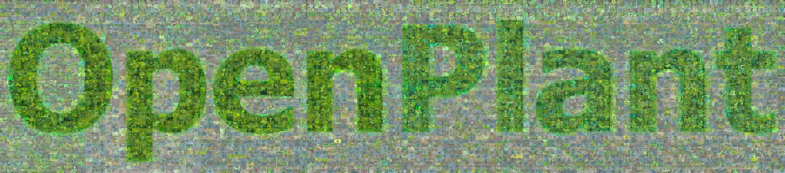

<p align="center">
  <a href="assets/logo/openplant-mosaic.tiff">
    
  </a>
</p>

<h1 align="center">OpenPlant</h1>

<p align="center">
  <strong>A large-scale benchmark for agricultural plant classification</strong><br>
  <em>Plants · 2026 · 15(5), 727</em>
</p>

<p align="center">
  <a href="https://doi.org/10.3390/plants15050727">Paper</a> ·
  <a href="metadata/manifest.csv.gz">Image manifest</a> ·
  <a href="docs/sources.md">Source datasets</a> ·
  <a href="#get-started">Get started</a> ·
  <a href="docs/training.md">Training</a> ·
  <a href="docs/figures.md">Figure gallery</a>
</p>

<p align="center">
  Kaiqi Liu, Wei Sun, Guanping Wang, Quan Feng, and Hui Li<br>
  Gansu Agricultural University
</p>

| RGB images | Plant classes | Models evaluated in the paper |
|:---:|:---:|:---:|
| **635,176** | **1,167** | **28** — 10 CNNs · 6 ViTs · 12 VLMs |

OpenPlant brings agricultural crops, weeds, and wild plants into a shared classification benchmark spanning diverse growth stages, plant structures, and environments. Its long-tailed class distribution supports the study of plant recognition across common and rare categories, with comparisons across convolutional networks, vision transformers, and vision-language models.

This is the official repository for [**OpenPlant: A Large-Scale Benchmark Dataset for Agricultural Plant Classification Using CNNs, ViTs, and VLMs**](https://doi.org/10.3390/plants15050727). [Download the mosaic artwork](assets/logo/openplant-mosaic.tiff) as an original TIFF.

## Explore the dataset

The release connects every listed sample to its source, class, and fixed split. Explore the image manifest and source references, reconstruct the benchmark with the preparation tools, and train or evaluate **16 CNN/ViT baselines** using the supplied configurations and [OpenPlant checkpoints](model/).

### Data availability

Because of potential copyright and licensing conflicts, we cannot currently distribute the complete OpenPlant image collection. Some source datasets may prohibit redistribution of their original or modified images. Obtain images directly from the [original providers](docs/sources.md) under their respective terms, then [build OpenPlant locally](docs/reconstruction.md) using the released manifest and code. See [data terms](DATA_LICENSE.md) for details.

| Resource | Start here |
|---|---|
| **Images and labels** | [Complete manifest](metadata/manifest.csv.gz) · [Preview sample records](metadata/manifest_examples.csv) · [1,167 classes](metadata/classes.csv) |
| **Sources and references** | [41-dataset catalogue](docs/sources.md) · [Source contributions](metadata/source_counts.csv) · [BibTeX references](references/datasets.bib) |
| **Reconstruction** | [Prepare images from the fixed manifest](docs/reconstruction.md) |
| **Training and evaluation** | [16 model configurations and usage guide](docs/training.md) · [Model checkpoints](model/) |

### Fixed benchmark splits

| Split | Images |
|---|---:|
| Training | 443,996 |
| Validation | 63,224 |
| Test | 127,956 |
| **Total** | **635,176** |

Use the manifest's fixed train, validation, and test assignments for benchmark comparisons. The [source catalogue](docs/sources.md#source-catalogue) documents 41 datasets and traces the released samples to 39 named source groups.

<details>
<summary><strong>Browse all metadata files</strong></summary>

| File | Contents |
|---|---|
| [manifest.csv.gz](metadata/manifest.csv.gz) | All 635,176 sample records: source path, label, prepared path, and split |
| [manifest_examples.csv](metadata/manifest_examples.csv) | Small, directly browsable excerpt with the same columns |
| [classes.csv](metadata/classes.csv) | All 1,167 class IDs/names and per-split counts |
| [source_counts.csv](metadata/source_counts.csv) | Contributions of the 39 mapped source groups |
| [sources.csv](metadata/sources.csv) / [sources.json](metadata/sources.json) | 41 dataset entries with access links, citations, contribution counts, and recorded data terms |
| [source_label_mapping.json](metadata/source_label_mapping.json) | Historical source-label-to-scientific-name mapping |
| [summary.json](metadata/summary.json) | Counts, preparation protocol, and manifest checksum |
| [datasets.bib](references/datasets.bib) | Importable bibliography for the source datasets |

The [data dictionary](docs/metadata.md) describes source paths, class and split assignments, and optional image-verification fields.

</details>

## Get started

Use **Python 3.10 or later**. Start with the code and metadata; model checkpoints can be downloaded individually with Git LFS.

```bash
git -c filter.lfs.smudge= -c filter.lfs.process= -c filter.lfs.required=false clone https://github.com/Kaiqi6/OpenPlant.git
cd OpenPlant
python -m pip install -r requirements.txt
```

Check the manifest, class labels, and split counts:

```bash
python scripts/validate_dataset.py --manifest metadata/manifest.csv.gz --classes metadata/classes.csv --summary metadata/summary.json --manifest-only
```

### Prepare the images

1. Download the documented source versions from the [source catalogue](docs/sources.md).
2. Arrange the unpacked source directories using [the source-root instructions](docs/reconstruction.md). Keep annotations for the detection sources.
3. Reconstruct the samples listed in the manifest:

```bash
python scripts/build_dataset.py --source-root /path/to/downloads --output-root /path/to/OpenPlant-256 --manifest metadata/manifest.csv.gz
python scripts/validate_dataset.py --output-root /path/to/OpenPlant-256 --manifest metadata/manifest.csv.gz --classes metadata/classes.csv --summary metadata/summary.json
```

The build selects the recorded samples, extracts the specified plant regions where applicable, converts images to RGB, resizes the shorter edge to 256 pixels, and writes PNG files into the fixed `train/`, `val/`, and `test/` folders. Use `--source PlantVillage --limit 10` for a small trial, and `--resume` to verify and reuse previously built outputs.

Follow the [reconstruction guide](docs/reconstruction.md) for source layouts, filename mappings, and annotation requirements.

### Train and evaluate

Install a compatible PyTorch/torchvision pair for your machine, then:

```bash
python -m pip install -r requirements-train.txt
python scripts/train.py --data-root /path/to/OpenPlant-256 --config configs/resnet18.json --manifest metadata/manifest.csv.gz --output runs/resnet18 --device cuda
python scripts/evaluate.py --data-root /path/to/OpenPlant-256 --config configs/resnet18.json --manifest metadata/manifest.csv.gz --weights runs/resnet18/best.pt --output runs/resnet18-test --device cuda
```

<details>
<summary><strong>Evaluate a published OpenPlant checkpoint</strong></summary>

Install Git LFS, then retrieve the selected weights and run evaluation:

```bash
git lfs pull --include="model/resnet18.pth"
python scripts/evaluate.py --data-root /path/to/OpenPlant-256 --config configs/resnet18.json --manifest metadata/manifest.csv.gz --weights model/resnet18.pth --output runs/published-resnet18 --device cuda
```

</details>

The [training guide](docs/training.md) covers all 16 model configurations, CPU execution, checkpoint resume, metric definitions, and configuration provenance.

## Dataset diversity

### Common and rare plant classes


*Figure 1: the long-tailed class distribution and representative samples from head, medium, and tail classes.*

### Across sources and environments

<p align="center">
  
  
</p>

*Figure 2 panels: examples across data sources and dataset scale.*

<details>
<summary><strong>Explore the taxonomic hierarchy — 48 orders · 125 families · 428 genera</strong></summary>

<p align="center">
  
</p>

*Figure 3: taxonomic organization of OpenPlant. The paper reports 48 orders, 125 families, and 428 genera.*

</details>

## Published benchmark results

The paper compares **10 CNNs and 6 ViTs** on the classification benchmark and evaluates **12 VLMs** with a multiple-choice protocol. The panels below summarize the published comparisons.

### CNNs and vision transformers


*Figure 5b panel: representative CNN/ViT performance across classification metrics.*

### Vision-language models


*Figure 7: comparison of the vision-language models evaluated in the paper.*

Explore the [complete figure gallery](docs/figures.md) for model evolution, class-level accuracy, PR-AUC, confusion matrices, and prediction examples. See the [VLM protocol and evaluation scope](docs/training.md#vlm-scope) for details of the vision-language study.

## Citation and terms

Please cite OpenPlant and acknowledge the original datasets used in your experiments. The source bibliography includes article, dataset-deposit, and repository citations as appropriate.

```bibtex
@article{liu2026openplant,
  title   = {OpenPlant: A Large-Scale Benchmark Dataset for Agricultural Plant Classification Using CNNs, ViTs, and VLMs},
  author  = {Liu, Kaiqi and Sun, Wei and Wang, Guanping and Feng, Quan and Li, Hui},
  journal = {Plants},
  year    = {2026},
  volume  = {15},
  number  = {5},
  pages   = {727},
  doi     = {10.3390/plants15050727}
}
```

The software is released under the [MIT license](LICENSE). Original images, third-party metadata, model initialization weights, and source annotations retain their respective terms; see [DATA_LICENSE.md](DATA_LICENSE.md). Download source images through the [dataset catalogue](docs/sources.md).
