# Figures from the OpenPlant paper

Figures from [Liu et al., *Plants* 2026, 15(5), 727](https://doi.org/10.3390/plants15050727), with multi-panel figures shown as separate panels. [File records](../assets/figures/provenance.json) contain the original filenames and SHA-256 checksums.

## Figure 1: Long-tailed class distribution

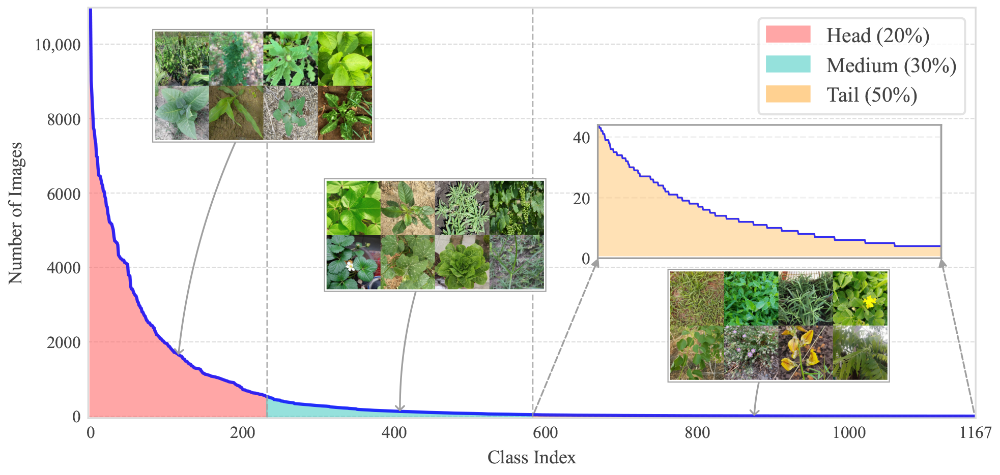

## Figure 2: Dataset diversity and scale

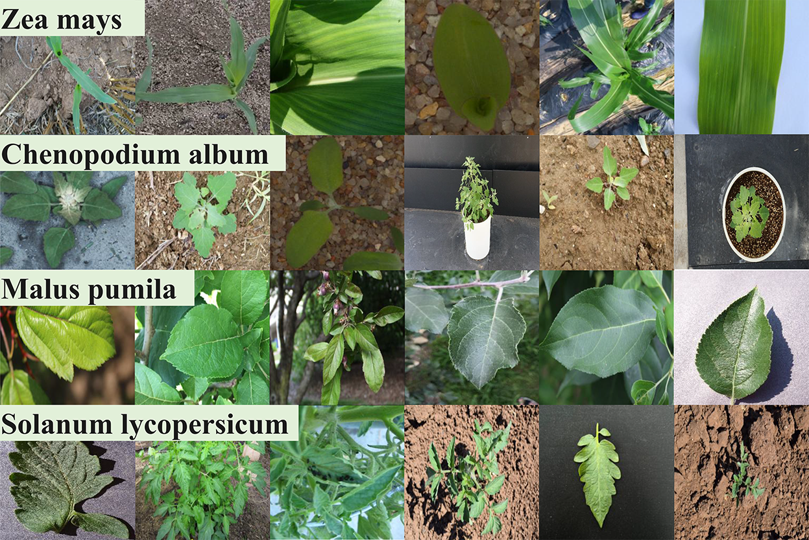

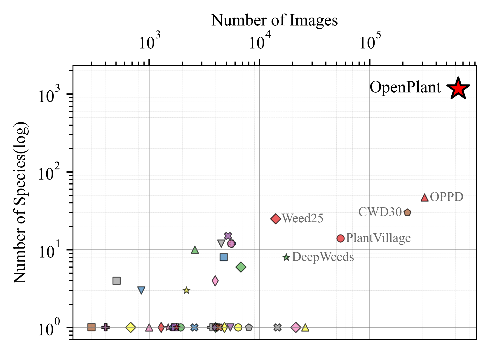

## Figure 3: Taxonomic hierarchy

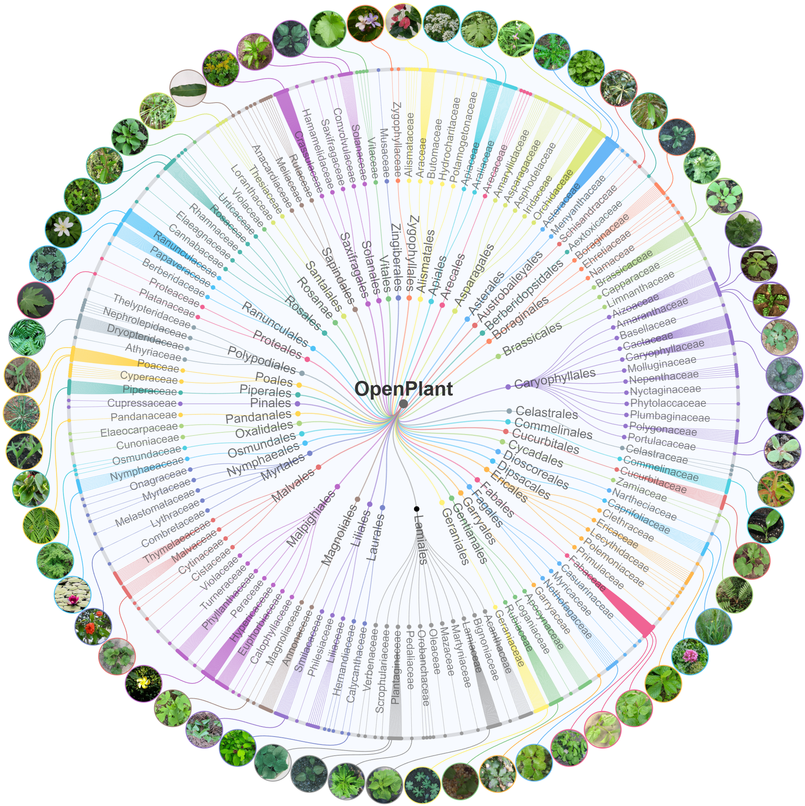

## Figure 4: Evaluated model families

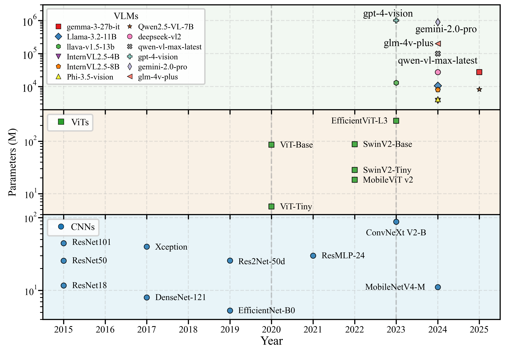

## Figure 5: CNN and ViT evaluation

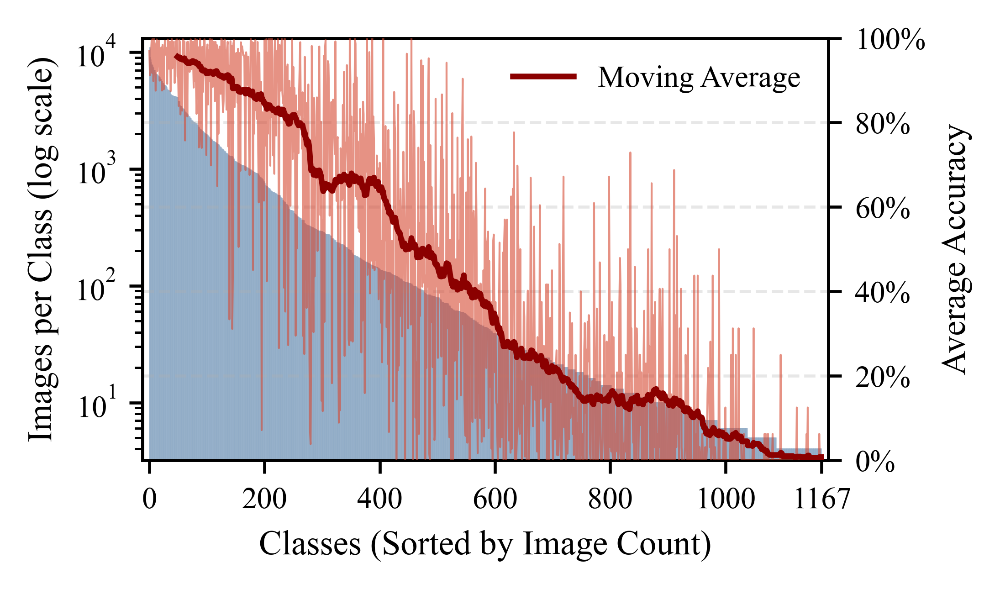

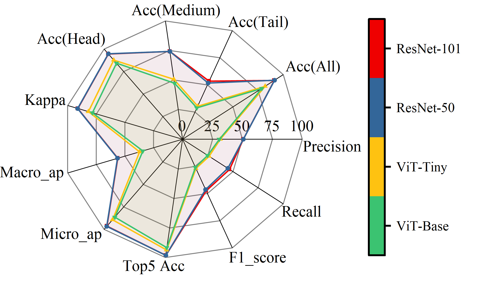

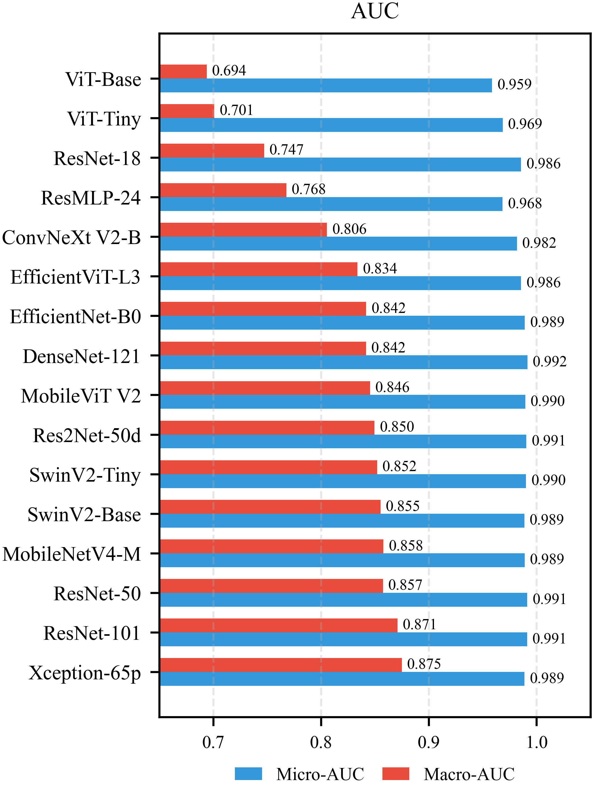

## Figure 6: CNN and ViT confusion patterns

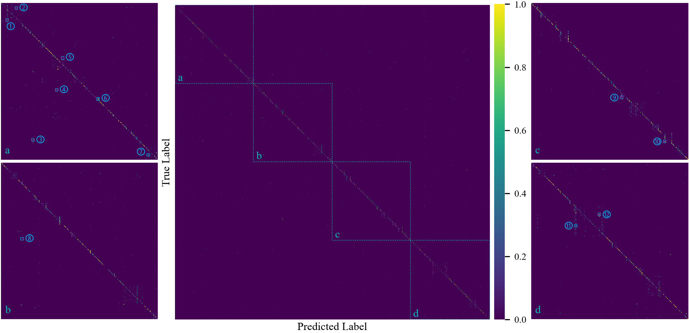

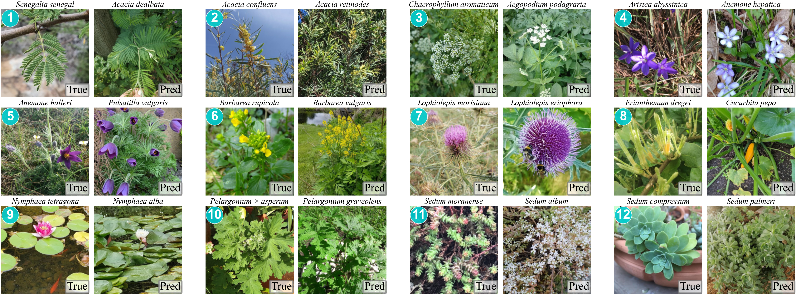

## Figure 7: Vision-language model evaluation

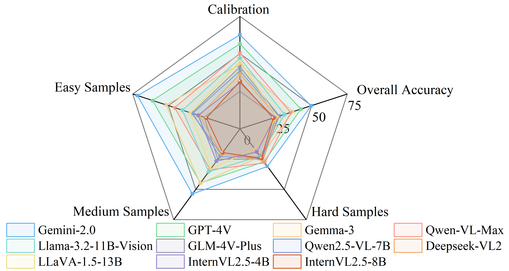

## Figure 8: VLM confusion patterns and examples

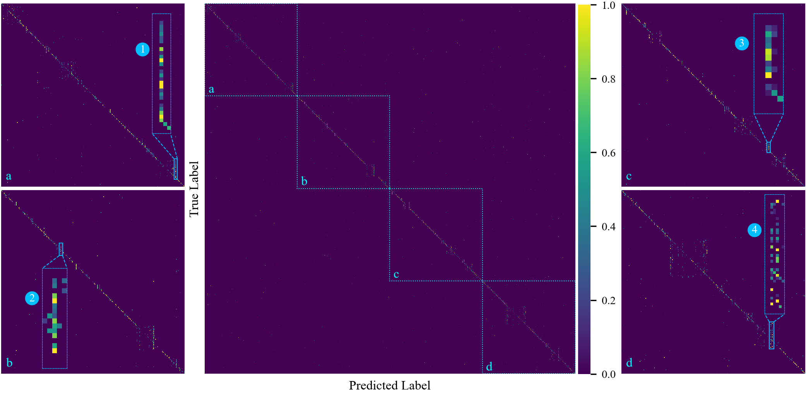

  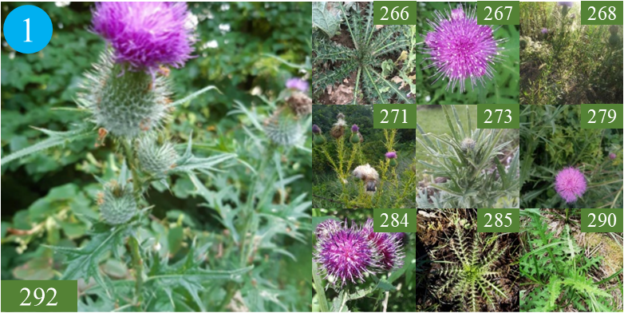
  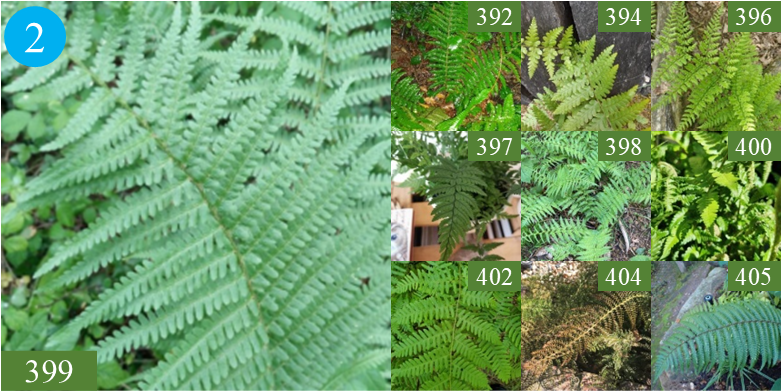
  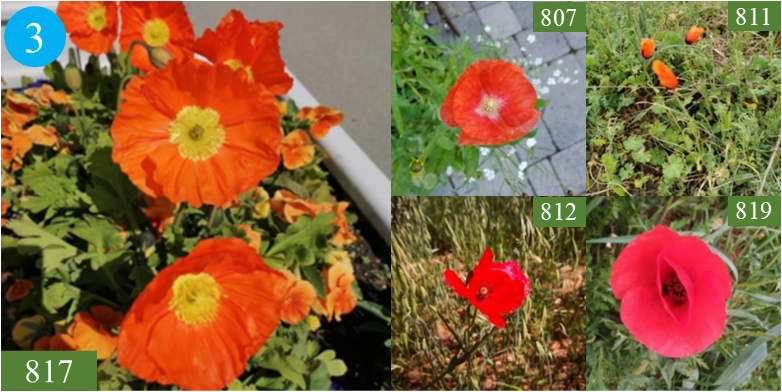
  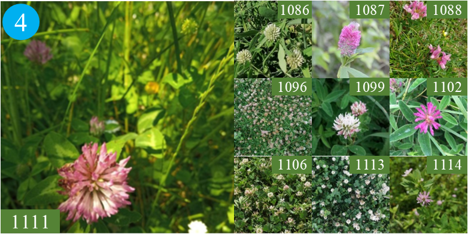

## Figure 9: Inter-model prediction similarity

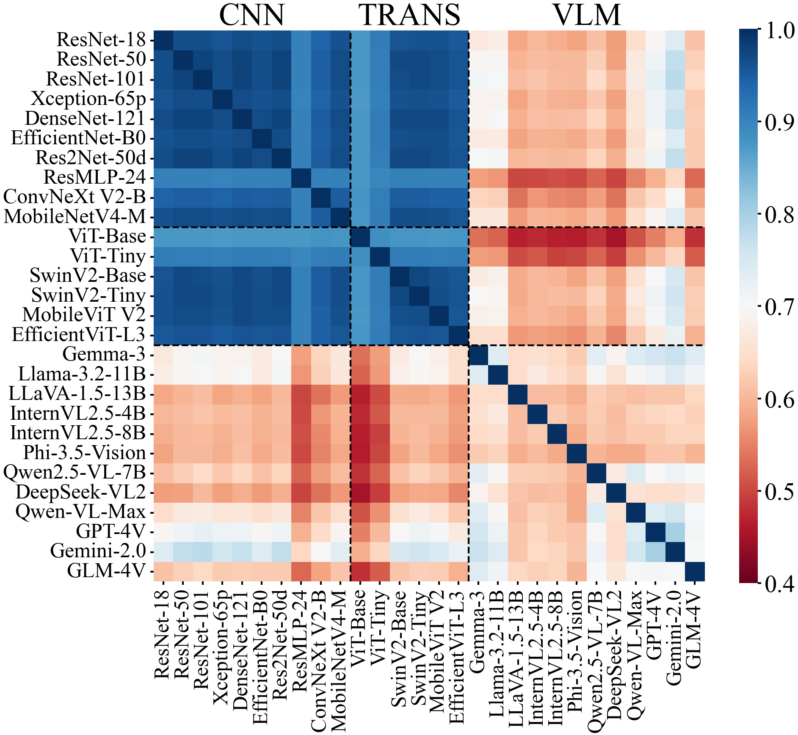

Cite OpenPlant and retain source image credits when reusing figures. [Data and figure terms](../DATA_LICENSE.md) cover reuse permissions and access to the underlying images.
